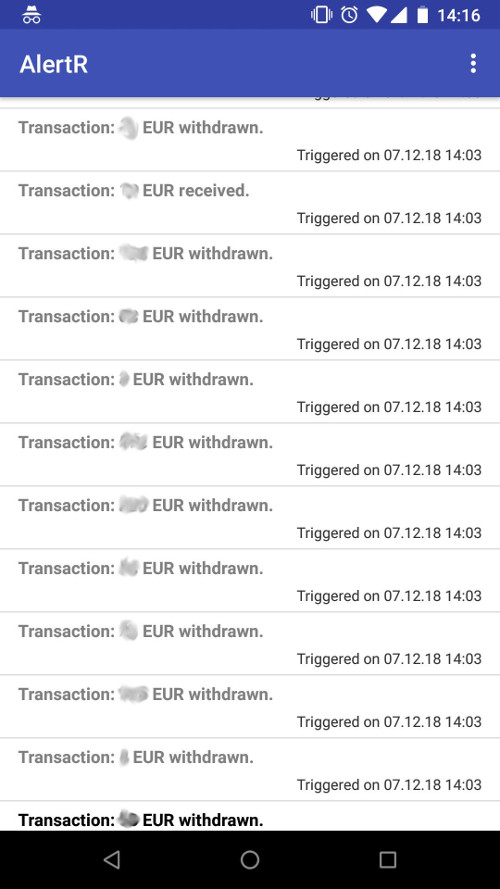

# Banking Monitoring

This daemon allows you to monitor your banking transactions and informs you via an end-to-end encrypted push notification to your Android device when a new transaction was made. It uses the FinTS 3.0 API to collect transactions from the bank. This API is used by German banks and some other European ones.

In order to not get always the same notifications at the beginning of each month (e.g., when you are paying your rent), you can add rules that whitelist certain transactions. When a transaction is whitelisted, the daemon will not send you any notification about it. This way, only irregular banking transactions cause a push notification.

Since banking transactions are confidential, the banking monitoring uses [LightweightPush](https://github.com/sqall01/lightweight-push-pip) to send an end-to-end encrypted message to your Android device. This way, only you are able to read the notification and no one in between can.




# Installation

This is a small and quick guide how to install the banking monitoring daemon. First we create a new user and install the needed python packages:

```bash
root@towelie:~# adduser --disabled-password banking
root@towelie:~# su banking
banking@towelie:/root# cd /home/banking
banking@towelie:~# pip3 install --user fints lightweightpush
```

Since the daemon uses [LightweightPush](https://github.com/sqall01/lightweight-push-pip) to send push notifications to your Android devices, you first have to [register an AlertR account](https://alertr.de/register/) and install the [AlertR Android App](https://play.google.com/store/apps/details?id=de.alertr.alertralarmnotification) on your devices. A more detailed description on how to setup the end-to-end encrypted push notification system is given [here](https://github.com/sqall01/lightweight-push).

Next we clone the repository and set it up the daemon:

```bash
banking@towelie:~# git clone https://github.com/sqall01/banking_monitoring.git
banking@towelie:~# cd banking_monitoring
banking@towelie:~/banking_monitoring# chmod 755 banking_monitor.py
banking@towelie:~/banking_monitoring# cd config
banking@towelie:~/banking_monitoring/config# cp config.xml.template config.xml
banking@towelie:~/banking_monitoring/config# chmod 700 config.xml
```

We set up some rules in the csv whitelist that is given as example:

```bash
banking@towelie:~/banking_monitoring/config# vim example_rules.csv

Description,IBAN,Amount,Currency,Start Day,End Day
Just some descriptive name for you,DE12340500000001234567,-50,EUR,1,7
```

This rule states that the IBAN `DE12340500000001234567` withdraws 50 euros from your account in the time frame from the 1st and the 7th of each month. If such a transaction is found, it is ignored and no notification is done.

Since the daemon uses the FinTS 3.0 API provided by the banks, you have to find the URL that provides the access point to the API. Unfortunately, this is different for every bank. There was a centralized database for these URLs, but unfortunately it was taken offline. Therefore, you have to search this URL for your bank yourself (or ask your bank for it).

After you found the URL for the FinTS API, the only thing missing is the configuration of the daemon:

```bash
banking@towelie:~/banking_monitoring/config# vim config.xml

[...]
```

The example configuration file is commented to explain what to place where. When everything is configured, just start the daemon by:

```bash
banking@towelie:~/banking_monitoring/# ./banking_monitor.py
```

If anything is not working, please take a look into the logfile.


# Support

If you like this project you can help to support it by contributing to it. You can contribute by writing tutorials, creating and documenting exciting new ideas to use it, writing code for it, and so on.

If you do not know how to do any of it or do not have the time, you can support me on [Patreon](https://www.patreon.com/sqall). Since services such as the push notification service have a monthly upkeep, the donation helps to keep these services free for everyone.

[](https://www.patreon.com/sqall)


# Bugs and Feedback

For questions, bugs and discussion please use the [Github Issues](https://github.com/sqall01/banking_monitoring/issues).